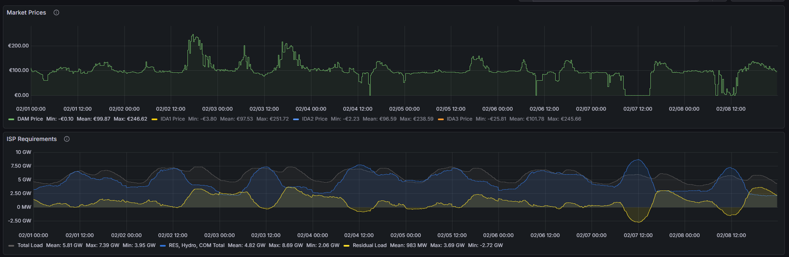

# Energy Market Data Warehouse Architecture

### 📖 Overview
This repository contains the foundational SQL architecture (DDL) for a centralized Energy Market Data Warehouse. It is designed to aggregate, structure, and serve high-frequency data for a Power Portfolio and Trading team.

The architecture effectively isolates data into distinct schemas, ensuring clear segregation between market pricing (DAM, Intraday, Commodities), grid operator expectations (Ex-Ante), and actual physical clearing results (Ex-Post). This structure forms the backbone for time-series forecasting, quantitative modeling, and real-time dashboarding.

### 🏛️ Database Architecture
The database is built on PostgreSQL and is structured around specialized schemas to support specific trading and analytical workflows:

#### 1. `market_data` Schema (Price & Commodity Engine)
Centralizes wholesale electricity prices and underlying commodity costs.
* `prices_gr`: Day-Ahead Market (DAM) and Intraday (ID1, ID2, ID3) cleared prices.
* `prices_neighbors`: Cross-border DAM prices (e.g., Italy, Bulgaria) for spread and flow analysis.
* `commodity_prices`: Daily closing prices for European Gas (TTF) and Carbon Allowances (EUA), essential for calculating the Short-Run Marginal Cost (SRMC) of thermal units.

#### 2. `grid_ex_ante` Schema (TSO Forecasting & Requirements)
Captures the Transmission System Operator's (ADMIE/IPTO) expectations before physical delivery. Critical for predictive modeling.
* `isp_requirements`: Integrated Scheduling Process (ISP) parameters including load forecasts, RES forecasts, and reserve requirements (Up/Down).
* `unit_availabilities`: Thermal unit availability forecasts and scheduled outages.

#### 3. `grid_ex_post` Schema (Physical Clearing & Imbalance)
Stores the actual physical clearing results and activated energy from the Balancing Market.
* `isp_system_results`: Contains actual system load, thermal/RES/hydro cleared volumes, and activated balancing energy (Up/Down). *Note: The `activated_energy_up` is a key indicator of system direction (Short/Long) and imbalance price pressure.*

#### 4. `analytics_features` Schema (The ML & BI Layer)
A dedicated schema for SQL Views that transform raw tables into engineered features.
* Intended for building the `feature_store_dam` for Machine Learning forecasting and `economic_metrics` for real-time Grafana monitoring.

### 📊 Visualization & Real-Time Monitoring
The structured data from this warehouse feeds directly into Grafana for real-time market monitoring and portfolio risk assessment. 

*(Example: Grafana Dashboard displaying Market Prices and ISP Requirements)*

